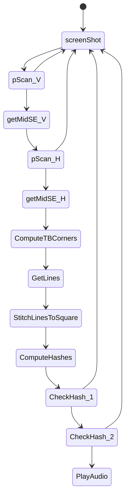

# SpokenScreen
Core pattern detection / audio playback / hash calculation / image collection code

testColors:

White: 255, 255, 255
White to Red (one pixel): 246, 144, 145
Red: 237, 28, 36
Red to Green (one pixel): 135, 103, 56
Green: 34, 177, 76
Green to Orange (one pixel): 145, 152, 58
Orange: 255, 127, 39
Orange to Green (one pixel): 145, 152, 58
Green: 34, 177, 76
Green to Blue (one pixel): 17, 169, 154
Blue: 0, 162, 232
Blue to White (one pixel): 127, 208, 243
White: 255, 255, 255

TODO: Implement Implement loading of screenshot to 2D pixel array / numpy pixel list: https://stackoverflow.com/questions/60293637/read-image-pixels-row-by-row

# Pokemon FireRed Operations

## Text box detection

1. Take screenshot
2. pixelSequenceScan the center column of pixels, bottom half of the screen for text box colors
3. If not successful, return to screenshot
4. If successful, get pixelSequenceScan of row between column edges
...

ch

